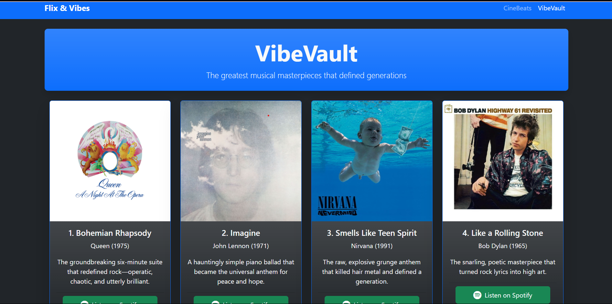
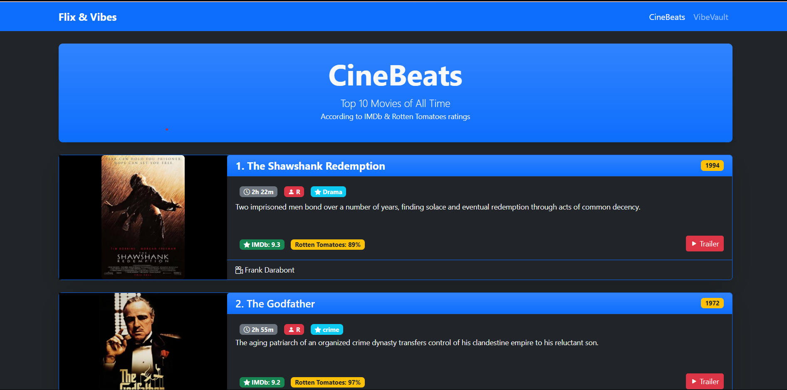

# 🎬 Flix-Vibes

Welcome to **Flix-Vibes** — a fan-made tribute to the world of cinema! This website celebrates the magic of movies, offering a curated collection of top-rated films across various genres. Whether you're a casual viewer or a cinephile, Flix-Vibes aims to enhance your movie-watching experience.

## 📖 Description

Flix-Vibes is a static website designed to showcase a selection of top movies. The project emphasizes clean design and user-friendly navigation, providing visitors with an engaging platform to explore cinematic masterpieces.

## 🌐 Live Demo

[Link to live site](https://divyansh3105.github.io/Flix-Vibes/)

## 🗂️ Project Structure

- `index.html` — The homepage featuring an overview of the Flix-Vibes platform.
- `top_movie.html` — A dedicated page highlighting top-rated movies.
- `Media/` — Contains images and other media assets used throughout the site.

## 🎯 Features

- **Top Movies Showcase** — Explore a curated list of top-rated films.
- **Responsive Design** — Optimized for various devices and screen sizes.
- **Media Integration** — Rich visuals to enhance user engagement.

## 🚀 Getting Started

To view the Flix-Vibes website locally:

1. Clone the repository:
   ```bash
   git clone https://github.com/Divyansh3105/Flix-Vibes.git

2. Navigate to the project directory:
   ```bash
   cd Flix-Vibes

3. Open `index.html` in your preferred web browser.

## 📸 Screenshots

<div align="center">
    
    
</div>

## License

This project is open-source and available under the MIT License.

## Author

**Divyansh Garg**

## Contact

- 📧 Email: divyanshgarg3105@gmail.com
- 🌐 GitHub: [GitHub Profile](https://github.com/Divyansh3105)
